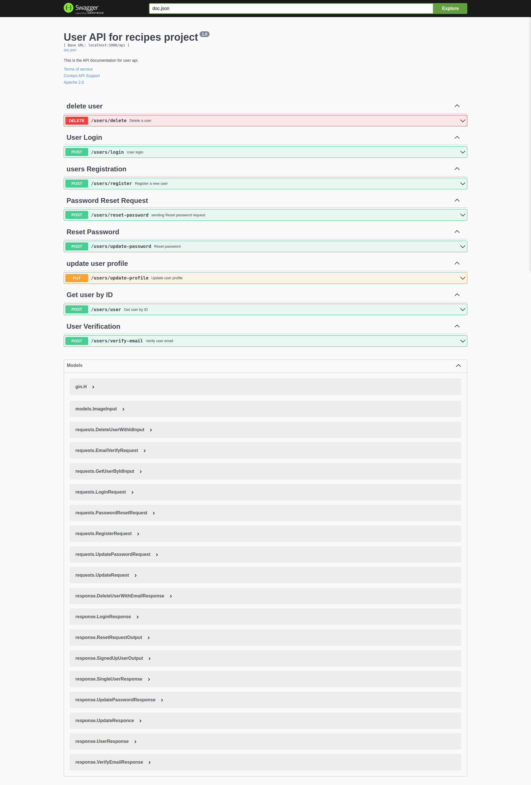

# Cookit Recipe App

This is a **Recipe Managment App** built for internship entrance test for Minab Tech. It is developed using **Golang**, **PostgreSQL**, and **Hasura GraphQL**, and runs with **Docker**.

## Features

- **User Authentication**
  - Custom authentication using **JWT** and **bcrypt**
  - OAuth authentication via **Google** and **GitHub**
- **GraphQL API with Hasura**
- **Image Uploading with Cloudinary**
- **Email Verification & Password Reset via Google SMTP**
- **Payments Integration with Chapa**
  - Payments are handled using **Chapa**, allowing secure and seamless transactions.
- **Go GraphQL Client for Hasura**
- **Gin Framework for API Routing**
- **Recipe Management System**
  - Create, Read, Update, Delete (CRUD) Recipes
  - Categories & Tags: Organize recipes by categories and add relevant tags for better searchability.
  - Ingredients & Instructions: Detailed ingredient lists and step-by-step cooking instructions.
  - User-Generated Recipes: Users can create and share their own recipes.
  - Favorites & Bookmarks: Save favorite recipes for quick access.
  - Ratings & Reviews: Allow users to rate recipes and leave feedback.
  - Search & Filtering: Find recipes based on ingredients, categories, or preparation time.

## Getting Started

### Prerequisites

- Docker
- Golang
- Hasura CLI

### Installation

1. Clone the repository:
   ```sh
   git clone [https://github.com/LidoHon/recipes-server.git](https://github.com/LidoHon/recipes-server.git)
   cd recipes-server
   ```
2. Set up your environment variables in a `.env` file:

   ```ini
   PORT=
   POSTGRES_USER=
   POSTGRES_PASSWORD=
   POSTGRES_DB=
   HASURA_GRAPHQL_PORT=
   ACTION_BASE_URL=
   HASURA_GRAPHQL_ADMIN_SECRET=
   HASURA_ACTION_SECRET=
   HASURA_GRAPHQL_DATABASE_URL=
   HASURA_GRAPHQL_API_ENDPOINT=
   HASURA_GRAPHQL_ENDPOINT=
   DB_HOST=
   DB_PORT=
   DB_USER=
   DB_PASSWORD=
   DB_NAME=
   JWT_SECRET_KEY=
   RESET_PASS_URL=
   CHAPA_RETURN_URL=
   EMAIL_HOST=
   EMAIL_USERNAME=
   GOOGLE_EMAIL_PASSWORD=
   EMAIL_PASSWORD=
   FROM_EMAIL=
   SERVICE=
   GMAIL_HOST=
   GMAIL_PORT=
   EMAIL_PORT=
   CLOUD_NAME=
   CLOUDINARY_API_KEY=
   CLOUDINARY_API_SECRET=
   CLOUDINARY_URL=
   CHAPA_SECRET_KEY=
   CHAPA_PUBLIC_KEY=
   CHAPA_PAYMENT_ENDPOINT=
   CHAPA_BANKS_ENDPOINT=
   CHAPA_TRANSACTION_VERIFICATION_ENDPOINT=
   CHAPA_CALLBACK_URL=
   BASE_URL=
   CLIENT_LOGIN_URL=
   CLIENT_HOMEPAGE_URL=
   GOOGLE_CLIENT_ID=
   GOOGLE_CLIENT_SECRET=
   GITHUB_CLIENT_ID=
   GITHUB_CLIENT_SECRET=
   SESSION_SECRET=
   ```

3. Start the services using Docker:
   ```sh
   docker-compose up -d
   ```
4. Run the Go Backend

   - **Navigate to the go-app directory:**

   ```sh
   cd go-app
   ```

   - **Run the app:**

     - Using `go run`:

     ```sh
     go run main.go
     ```

     - Using `air` (for live reloading):

     ```sh
     air
     ```

     - Using a Makefile:

     ```sh
     make run-go-app
     ```

## Hasura console

Run Hasura Console using the CLI:

```

hasura console --admin-secret "<your admin secret>"
```

This will start the Hasura console at: http://localhost:9695/

## API Documentation

To generate or update the API documentation, run:

```sh
swag init --parseDependency --parseInternal
```

or just

```sh
swag init
```

- Then, open your browser and visit:

```sh
http://localhost:<port>/swagger/index.html#/
```

Replace <port> with your actual server port.

**Documentation**



## Deployment

To deploy the application, ensure all environment variables are correctly set and run:

```sh
docker-compose up --build -d
```

## Contributing

Feel free to submit issues and pull requests to improve the project!

## License

This project is licensed under the **MIT License**.
